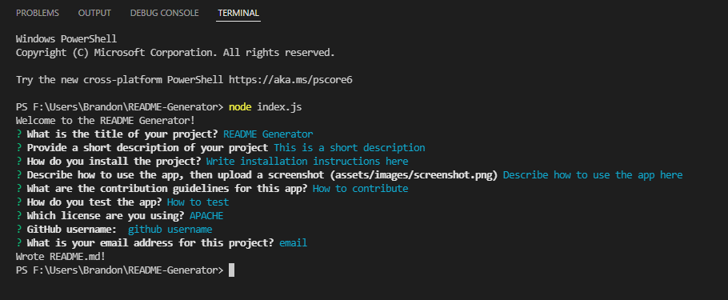

  # README Generator

  
  
  ## Description

  A simple project to create a high-quality professional readme

  ## Table of Contents 
  
  - [Installation](#installation)
  - [Usage](#usage)
  - [Contribute](#contribute)
  - [Test](#test)
  - [License](#license)
  - [Questions](#questions)
  
  ## Installation

  Install by following the video or instructions on the github page
  
  ## Usage

  follow the prompts in the terminal
  
  
  
  ## Contribute

  Explain how to contribute to the project
  
  ## Test

  Explain how to test the project
  
  
  ## License
  [MIT](https://opensource.org/licenses/MIT)
  
  ## Questions
  
  [GitHub Profile](https://github.com/bdubz93).
  
  Questions? You can email me at brandonwinkler@live.ca.
  